# OmniDesk AI — Enterprise RAG Customer Support Hub

<div align="center">


[](https://python.org)
[](https://fastapi.tiangolo.com)
[](https://trychroma.com)
[](https://ai.google.dev)
[](LICENSE)

> **Zero-Hallucination AI Customer Service Grounded in Verified Enterprise Knowledge Bases.**  
> Powered by **Google Gemini 3.6 Flash**, Dense & Sparse Hybrid Search (BM25 + ChromaDB RRF), Multi-Modal Vision Claim Inspection, **FastAPI Backend**, **Support Hub SPA**, and **Streamlit Command Center**.

</div>

---

## 📑 Table of Contents

- [🏆 8-Phase Architecture Overview](#-8-phase-architecture-overview)
- [🌟 Key Capabilities by Phase](#-key-capabilities-by-phase)
- [🖥️ Frontend Experiences](#️-frontend-experiences)
- [📁 Repository Map](#-repository-map)
- [🚀 Quick Start Guide](#-quick-start-guide)
- [🌐 REST API & SSE Reference](#-rest-api--sse-reference)
- [🧪 Automated Test Suites](#-automated-test-suites)
- [☁️ Cloud Deployment](#️-cloud-deployment)
- [🔒 Security & Compliance](#-security--compliance)
- [📄 License](#-license)

---

## 🏆 8-Phase Architecture Overview

OmniDesk AI is an enterprise-grade customer support platform engineered to automate frontline resolutions with strict zero-hallucination guardrails, smart human-in-the-loop escalations, and automated policy verification.

```mermaid
flowchart TD
    subgraph ClientLayer["🖥️ Client & Interface Layer"]
        A1["Commercial Landing (index.html)"]
        A2["Support Hub SPA (app.html)"]
        A3["Streamlit Center (app.py)"]
    end

    subgraph SecurityLayer["🛡️ Security & Gateway (Phase 2)"]
        B1["Sliding-Window Rate Limiter (60 RPM)"]
        B2["Admin Key Auth (X-API-Key)"]
        B3["Pydantic Payload Validation (422)"]
    end

    subgraph CoreEngine["🧠 Core Intelligence & Retrieval (Phases 1, 4, 6, 8)"]
        C1["Language Detection (7 Languages)"]
        C2["Hybrid Search (BM25 + ChromaDB RRF)"]
        C3["Multi-Modal Vision Claim Inspection"]
        C4["Gemini 3.6 Flash Grounded Synthesizer"]
        C5["Intent & Sentiment Classifier"]
    end

    subgraph EscalationAndCopilot["⚡ Escalations, Copilot & Macros (Phases 3, 5, 6)"]
        D1["Ticket Escalation & CUST-XXXX Routing"]
        D2["AI Copilot Grounded Reply Generator"]
        D3["Message Threading & Internal Staff Notes"]
        D4["Live SLA Urgency Countdown Engine"]
        D5["Macro Automation Rules Engine"]
    end

    subgraph OpsAndBenchmarking["📊 Enterprise Operations (Phases 6, 7)"]
        E1["CSAT Telemetry & Dynamic Analytics"]
        E2["Outbound Incident Webhooks (Slack/PagerDuty)"]
        E3["Autonomous Synthetic Benchmark Studio"]
    end

    ClientLayer --> SecurityLayer
    SecurityLayer --> CoreEngine
    CoreEngine --> EscalationAndCopilot
    EscalationAndCopilot --> OpsAndBenchmarking
```



---

## 🌟 Key Capabilities by Phase

### 1. Phase 1: Core Grounded RAG & Real-Time SSE Token Streaming
- **Dense Embedding Search**: Chunks and indexes company policies (`company_faq.txt`) into ChromaDB using 3,072-dim embeddings.
- **Server-Sent Events (SSE)**: Streaming endpoint (`/ask/stream`) delivering sub-second token streams with verified citations.
- **Strict Distance Guardrails**: Deflects out-of-scope/unverified inquiries to human agents to prevent hallucinations.

### 2. Phase 2: Production Hardening & Security
- **Sliding-Window Rate Limiting**: Per-client IP throttling returning `HTTP 429 Too Many Requests` with dynamic `Retry-After`.
- **Admin API Key Authorization**: Sensitive management endpoints guarded via `X-API-Key` headers.
- **Input Validation**: Pydantic models enforcing payload size limits and non-empty checks (`422 Unprocessable Entity`).

### 3. Phase 3: Smart Escalation & Customer ID Routing
- **Automated Ticket Creation**: Automatic customer profile assignment (`CUST-XXXX`), VIP tier tracking, and priority triage.
- **Lifecycle Workflows**: Status transitions (`Open` $\to$ `In Progress` $\to$ `Resolved`), agent assignments, and resolution tracking.

### 4. Phase 4: Multi-Channel Intent Classification & CRM Export
- **Intent & Urgency Classification**: Auto-tagging inquiries into `Return & Refund`, `Shipping & Logistics`, `Warranty & Claims`, `Billing & Payment`, `Order Modification`.
- **CRM Integration**: 1-click CSV and JSON data export streams.
- **Streamlit Command Center ([app.py](file:///c:/Users/kastu/Desktop/mahesh%20pro/app.py))**: 4-tab control center.

### 5. Phase 5: AI Agent Copilot & Live SLA Countdown Engine
- **AI Reply Draft Generator (`/api/tickets/{id}/suggest-reply`)**: Synthesizes grounded resolution drafts referencing official policies.
- **Conversation Threading & Internal Staff Notes**: Chronological thread of customer interactions with private amber-locked internal notes (`🔒 Staff Note`).
- **Live SLA Countdown Badges**: Real-time dynamic countdowns (Urgent: 1h, High: 4h, Medium: 24h, Low: 48h).

### 6. Phase 6: Multi-Language Auto-Localization, CSAT & Quick Macros
- **7-Language Localization**: Automatic language detection and localized RAG answering (English, Spanish, French, German, Japanese, Portuguese, Hindi).
- **CSAT Feedback Telemetry**: Dynamic `👍 Helpful` and `👎 Needs Work` ratings with live scoring (`/api/analytics`).
- **Macro Automation Rules**: Pre-configured templates (`📦 30-Day RMA`, `🛡️ 1-Yr Warranty`, `💳 Price Match`, `✈️ DHL DDP`) with automatic variable substitution (`{{customer_name}}`, `{{ticket_id}}`, `{{assigned_agent}}`).

### 7. Phase 7: Autonomous Synthetic Benchmarking & Incident Webhooks
- **Synthetic Load & Accuracy Benchmark Studio**: Telemetry measuring Throughput (QPS), Latency percentiles (P50, P90, P99), Guardrail precision, and Intent classification accuracy across simulated test scenarios.
- **Outbound Incident Webhook Alert Dispatcher**: Automatic incident dispatching to external systems (e.g. Slack `#support-alerts`, PagerDuty) on urgent VIP tickets or low CSAT ratings.

### 8. Phase 8: Hybrid Search & Multi-Modal Vision RAG Claim Inspection
- **Hybrid Search (BM25 + Vector RRF)**: Reciprocal Rank Fusion combining keyword exact-matching with semantic dense embeddings for high-precision retrieval (`/api/search/hybrid`).
- **Multi-Modal Vision Claim Inspection**: Inspects product photos and damage claims, cross-referencing visual defects against Section 4 warranty exclusion policies to verify coverage (`/api/vision/analyze-claim`).

---

## 🖥️ Frontend Experiences

| Interface | File | Description |
| :--- | :--- | :--- |
| **Customer Support Portal** | [app.html](file:///c:/Users/kastu/Desktop/mahesh%20pro/app.html) | Pure customer-facing help center with 24/7 AI chat, streaming responses, ticket lookup timeline, and multi-modal claim filing. |
| **UX & Admin Console** | [admin.html](file:///c:/Users/kastu/Desktop/mahesh%20pro/admin.html) | Restricted console for UX designers & managers with live feature flag toggles, ChromaDB knowledge studio, agent desk, and telemetry. |
| **Commercial Landing** | [index.html](file:///c:/Users/kastu/Desktop/mahesh%20pro/index.html) | Premium SaaS marketing page with live interactive demo simulator, ROI savings calculator, feature matrix, and pricing tiers. |
| **Command Center** | [app.py](file:///c:/Users/kastu/Desktop/mahesh%20pro/app.py) | Streamlit dashboard for ticket management, knowledge base re-indexing, live analytics, and system telemetry. |

---

## 📁 Repository Map

```text
├── index.html                  # Commercial SaaS marketing landing page
├── app.html                    # Customer Support Portal (AI chat, ticket tracking, claim intake)
├── admin.html                  # UX Feature Studio & Admin Operations Console
├── main.py                     # Universal ASGI server entry point (Docker/Railway/Uvicorn)
├── server.py                   # FastAPI REST backend with CORS, auth, SSE, Vision & webhooks
├── database.py                 # SQLite persistent storage (tickets, features, audit logs, webhooks)
├── rag_engine.py               # RAG pipeline with ChromaDB, Gemini, Hybrid Search & Benchmark
├── app.py                      # 4-Tab Streamlit enterprise control center
├── css/
│   └── style.css               # Core design system & modern glassmorphic styles
├── js/
│   ├── landing.js              # ROI calculator, demo simulator & interactions
│   ├── app.js                  # Customer Portal controller & fallback engine
│   └── admin.js                # UX Feature Studio & Admin Console controller
├── knowledge_base/
│   └── company_faq.txt         # Enterprise store policy knowledge dataset
├── test_master_suite.py        # Unified Master Test Suite (Phases 1 - 8)
├── test_phase8_features.py     # Hybrid Search & Vision Claim Inspection test suite
├── test_phase6_features.py     # Multi-Language, CSAT & Macro test suite
├── test_phase5_copilot.py      # Copilot, Threading & SLA test suite
├── test_phase4_features.py     # Intent classification & CRM export test suite
├── test_ticket_escalation.py   # Ticket lifecycle & escalation test suite
├── test_production_hardening.py# Rate limiting & admin auth test suite
├── test_rag_integration.py     # Core vector RAG pipeline test suite
├── doc/
│   ├── architecture.md         # Technical architecture & ChromaDB schemas
│   ├── design.md               # UI/UX design tokens & visual guidelines
│   ├── prd.md                  # Product requirements document
│   ├── memory.md               # System context & state tracking
│   ├── rules.md                # Engineering guidelines & coding standards
│   └── tasks.md                # Implementation roadmap
├── requirements.txt            # Python dependencies
├── .env.example                # Configuration & API key template
├── railway.json                # Railway cloud deployment manifest
├── nixpacks.toml               # Nixpacks build configuration
├── Procfile                    # Web process manager definition
└── README.md                   # Project documentation
```

---

## 🚀 Quick Start Guide

### 1. Prerequisites & Environment Setup

Ensure you have **Python 3.10+** installed:

```bash
# Clone the repository
git clone https://github.com/kasturimaheshbabu2316-mc/customer.git
cd customer

# Create and activate virtual environment
python -m venv .venv
# On Windows:
.venv\Scripts\activate
# On macOS/Linux:
source .venv/bin/activate

# Install dependencies
pip install -r requirements.txt
```

### 2. Configure Environment Variables

Create your `.env` file from the provided template:

```bash
cp .env.example .env
```

Configure your `.env` settings:

```env
GEMINI_API_KEY=your_google_gemini_api_key_here
ADMIN_API_KEY=admin-secret-key-2026
RATE_LIMIT_PER_MINUTE=60
BACKEND_HOST=0.0.0.0
BACKEND_PORT=8000
```

### 3. Start the Backend Server

```bash
python main.py
```

- **REST API & SSE**: `http://127.0.0.1:8000`
- **Interactive Swagger Documentation**: `http://127.0.0.1:8000/docs`
- **Health Check**: `http://127.0.0.1:8000/health`

### 4. Launch Frontend Applications

- **Support Hub Operator SPA**: Open [app.html](file:///c:/Users/kastu/Desktop/mahesh%20pro/app.html) directly in any modern browser.
- **Commercial Landing Page**: Open [index.html](file:///c:/Users/kastu/Desktop/mahesh%20pro/index.html).
- **Streamlit Control Center**:
  ```bash
  streamlit run app.py
  ```

---

## 🌐 REST API & SSE Reference

| Method | Endpoint | Description | Auth Required |
| :--- | :--- | :--- | :--- |
| `GET` | `/health` | System health check & ChromaDB status | No |
| `POST` | `/ask` | Grounded RAG query answering | No |
| `POST` | `/ask/stream` | Server-Sent Events (SSE) token stream | No |
| `POST` | `/api/search/hybrid` | BM25 + ChromaDB Reciprocal Rank Fusion search | No |
| `POST` | `/api/vision/analyze-claim` | Multi-modal vision claim inspection | No |
| `POST` | `/api/tickets` | Create escalated customer support ticket | No |
| `GET` | `/api/tickets` | List and filter customer tickets | No |
| `POST` | `/api/tickets/{id}/suggest-reply` | Generate AI Copilot grounded response | No |
| `POST` | `/api/tickets/{id}/messages` | Append message or internal staff note | No |
| `POST` | `/api/csat` | Submit CSAT rating (`helpful` / `unhelpful`) | No |
| `GET` | `/api/analytics` | Resolution rate & CSAT analytics | No |
| `POST` | `/api/benchmark/run` | Execute synthetic load & accuracy benchmark | `X-API-Key` |
| `GET` | `/api/crm/export` | Export CRM ticket data (CSV or JSON) | `X-API-Key` |
| `POST` | `/api/knowledge/reindex` | Re-index policy knowledge base into ChromaDB | `X-API-Key` |

---

## 🧪 Automated Test Suites

OmniDesk AI includes a comprehensive validation suite covering all capabilities:

### Unified Master Test Suite (Phases 1 - 7)

```bash
python test_master_suite.py
```

### Phase 8 Test Suite (Hybrid Search & Multi-Modal Vision)

```bash
python test_phase8_features.py
```

### Individual Test Suites

```bash
python test_rag_integration.py      # Core Grounded RAG & Distance Guardrails
python test_production_hardening.py # Rate Limiting & Admin Key Auth
python test_ticket_escalation.py    # Ticket Lifecycle & SLA Routing
python test_phase4_features.py      # Intent Classification & CRM Export
python test_phase5_copilot.py       # Copilot Drafts & Message Threading
python test_phase6_features.py      # Multi-Language, CSAT & Quick Macros
```

---

## ☁️ Cloud Deployment

### Railway / Render Deployment

The repository includes ready-to-deploy cloud manifests:
- `railway.json` & `nixpacks.toml`: Configured for zero-config Railway builds.
- `Procfile`: Declares the web process `web: python main.py`.

### Docker Deployment

```bash
# Build Docker image
docker build -t omnidesk-ai .

# Run container
docker run -p 8000:8000 --env-file .env omnidesk-ai
```

---

## 🔒 Security & Compliance

- **Zero-Hallucination Policy**: Strict ChromaDB distance thresholding prevents hallucinated statements.
- **Sliding-Window Throttling**: Protects endpoints against brute-force and scraping.
- **Admin Isolation**: Knowledge base modification and benchmark execution require `X-API-Key`.
- **Payload Sanitization**: Pydantic schema validation defends against malformed payloads.

---

## 📄 License

This project is licensed under the **MIT License**. See the [LICENSE](LICENSE) file for details.
