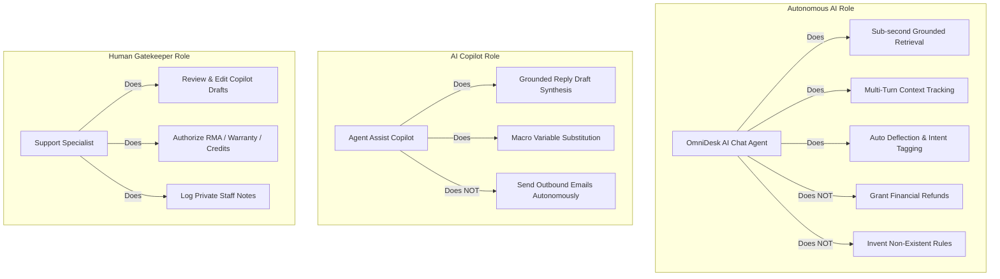

# OmniDesk AI — The Six-Box Design Canvas

---

## Executive Overview & Capstone Readiness

This document defines the formal **Six-Box Design Canvas** for **OmniDesk AI**, establishing operational clarity across problem definitions, actor boundaries, information handoffs, sources of truth, human oversight gates, and measurable risks.

> **Capstone Readiness Verification**:  
> **Status**: **PASSED (6 / 6 Boxes Populated and Grounded)**  
> All six dimensions are implemented, verified in active code, and tested against automated benchmarks.

```
┌─────────────────────────────────────────────────────────────────────────────────────────────────────────┐
│                                       THE SIX-BOX DESIGN CANVAS                                         │
├───────────────────────────────────┬───────────────────────────────────┬─────────────────────────────────┤
│ 1. Problem                        │ 2. Roles                          │ 3. Handoffs                     │
│    What pain? For whom?           │    Who does what—and not what?    │    What packet moves?           │
├───────────────────────────────────┼───────────────────────────────────┼─────────────────────────────────┤
│ 4. Tools & Data                   │ 5. Human Gates                    │ 6. Risks & Metrics              │
│    Where does truth live?         │    When must a person decide?     │    How fail? How measure?       │
└───────────────────────────────────┴───────────────────────────────────┴─────────────────────────────────┘
```

---

## 1. Problem
> *What pain? For whom?*

### 1.1 Target Stakeholders & Personas
1. **End Customers (Retail Shoppers & VIP Accounts)**: Expect instantaneous, reliable answers 24/7 regarding return windows, customs duties, warranties, and order modifications.
2. **Support Specialists (Tier 1 & Tier 2 Agents)**: Strained by massive ticket backlogs, repetitive standard questions, and context switching across unintegrated tools.
3. **Support Operations Leads & Enterprise Executives**: Subject to compliance risks, costly dispute resolutions caused by hallucinated AI answers, and SLA breach penalties.

### 1.2 The Core Pains
* **Hallucination & Compliance Liability**: Generic LLMs invent unverified policies (e.g., promising full refunds on final-sale electronics or custom return windows), exposing companies to legal and financial disputes.
* **Tier 1 Support Inefficiency**: 70% to 80% of daily incoming volume consists of repetitive FAQ queries, driving up operational costs and delaying responses to high-value VIP escalations.
* **Fragmented Agent Context**: When issues are escalated, human agents must manually decipher ticket history, calculate remaining SLA time, search policy docs, and draft replies from scratch.

---

## 2. Roles
> *Who does what—and not what?*



### Role Matrix

| Actor | What They Do | What They Do **NOT** Do |
| :--- | :--- | :--- |
| **OmniDesk AI Agent** *(RAG Engine)* | • Answers inquiries strictly using indexed policy clauses (`company_faq.txt`).<br>• Streams tokens with sub-second TTFT via Server-Sent Events (`/ask/stream`).<br>• Maintains conversational multi-turn context (`history`).<br>• Auto-classifies intent (7 categories) and urgency sentiment.<br>• Deflects queries exceeding the cosine distance threshold ($>1.2$). | • **Never** invents policies, pricing, or unauthorized discounts.<br>• **Never** modifies order or payment records unilaterally.<br>• **Never** locks a customer out from requesting human support. |
| **AI Copilot** *(Agent Assist)* | • Synthesizes personalized draft replies (`/api/tickets/{id}/suggest-reply`) grounded in policies and customer tier.<br>• Recommends pre-approved macros with variable substitution. | • **Never** dispatches emails or messages directly to customers without human agent review. |
| **Support Specialist** *(Human Agent)* | • Reviews deflected and escalated tickets in the queue.<br>• Approves, edits, or personalizes AI-generated reply drafts.<br>• Authorizes RMA return labels, warranty replacements, and price matches.<br>• Logs internal, private staff notes (`🔒 Staff Note`). | • Does not have to calculate SLA breach windows manually.<br>• Does not type standard policy answers from scratch. |
| **Knowledge Base Admin** | • Curates and uploads company policy documents.<br>• Triggers 1-click re-indexing of ChromaDB vector store.<br>• Configures guardrail distance cutoffs and LLM parameters. | • Does not handle individual customer ticket triage. |

---

## 3. Handoffs
> *What packet moves between roles?*

OmniDesk AI enforces structured, validated JSON data packets for all cross-role interactions:

### 3.1 Customer $\to$ AI Agent: Inquiry Packet (`QueryRequest`)
* **Transport**: `POST /ask` or `POST /ask/stream`
* **Schema**:
  ```json
  {
    "query": "Can I return open-box items?",
    "language": "English",
    "history": [
      { "role": "user", "content": "Can I return electronics within 30 days?" },
      { "role": "assistant", "content": "Yes, electronics can be returned within 30 days." }
    ]
  }
  ```

### 3.2 AI Agent $\to$ Customer: Resolution Packet (`QueryResponse`)
* **Transport**: SSE Stream or JSON Response
* **Contents**:
  * `answer`: Grounded synthesis strictly verified against knowledge base.
  * `sources`: Verified reference clauses cited with vector distance metrics.
  * `distances`: Cosine similarity scores per retrieved clause.
  * `deflected`: Boolean flag indicating whether the query was within policy bounds.
  * `intent` & `sentiment`: Categorical classifications (`Return & Refund`, `High Urgency`).
  * `latency_ms`: Execution time telemetry.

### 3.3 AI Agent $\to$ Human Support Queue: Escalation Packet (`TicketPacket`)
* **Transport**: Database write (`omnidesk.db`) & Real-time queue broadcast
* **Contents**:
  ```json
  {
    "ticket_id": "TCK-8492",
    "customer_id": "CUST-4109",
    "customer_name": "Elena Rostova",
    "customer_tier": "VIP Enterprise",
    "priority": "Urgent",
    "subject": "Damaged OLED Display upon Delivery",
    "query": "The 65-inch screen arrived shattered in the box.",
    "intent": "Warranty & Claims",
    "sentiment": "High Urgency",
    "sla_deadline_ts": 1727804400,
    "sla_remaining_minutes": 58,
    "status": "Open"
  }
  ```

### 3.4 AI Copilot $\to$ Human Agent: Draft Proposal Packet
* **Transport**: `GET /api/tickets/{id}/suggest-reply`
* **Contents**: Suggested resolution email containing customer greeting, policy clause citations, recommended RMA steps, and closing signature.

### 3.5 System $\to$ External Operations: Incident Webhook Packet
* **Transport**: HTTP POST to Slack `#support-alerts` or PagerDuty
* **Trigger**: Created on `Urgent` VIP tickets, SLA deadline $\le 30\text{m}$, or CSAT rating $\le 2/5$.

---

## 4. Tools & Data
> *Where does truth live?*

| Data / Component | Technology | Role & Truth Boundary |
| :--- | :--- | :--- |
| **Enterprise Policy Knowledge Base** | `knowledge_base/company_faq.txt` | Ground-truth repository for all verified store policies, return windows, warranties, and rates. |
| **Vector Storage & Semantic Index** | **ChromaDB** (`./chroma_db`) | High-speed persistent vector index with cosine similarity and deterministic fallback hashing. |
| **Dense Embeddings** | `gemini-embedding-001` (Google GenAI) | 768-dimensional dense vector embeddings. |
| **Generative LLM Inference** | `gemini-3.6-flash` (Google GenAI) | Grounded generative synthesizer operated at `temperature: 0.1` for maximum policy fidelity. |
| **Local Grounded Fallback Engine** | Python (`rag_engine.py`) | Deterministic regex/clause extractor ensuring 100% uptime during network or API outages. |
| **Persistent CRM & Telemetry Database** | **SQLite** (`omnidesk.db` via `database.py`) | Thread-safe, persistent storage for tickets, conversation threads, staff notes, and CSAT logs. |
| **Rate Limiter & Gateway** | Python sliding-window (`server.py`) | 60 RPM per client IP enforced via timestamp deques. |
| **Configuration Truth** | `.env` & `doc/memory.md` | Single source of truth for ADRs, API credentials, and runtime parameters. |

---

## 5. Human Gates
> *When must a person decide?*

OmniDesk AI is designed around a **Human-in-the-Loop (HITL)** architecture. The system establishes 5 explicit human decision gates:

```
[Customer Query]
       │
       ▼
[Distance > 1.2?] ──YES──► [GATE 1: Human Triage Required (Deflection)]
       │ NO
       ▼
[Standard Answer Streamed]
       │
[Customer Requests Escalation] ──YES──► [GATE 1: Human Support Ticket Created]
                                                │
                                                ▼
                        [GATE 2: AI Copilot Suggests Draft]
                                                │
                                                ▼
                        [Human Specialist Reviews & Edits]
                                                │
                                                ▼
                        [GATE 3: Authorize Macro / RMA / Credit]
                                                │
                                                ▼
                        [GATE 4: Human Resolves & Closes Ticket]
```

1. **Gate 1: Policy Out-of-Scope Deflection**: When an inquiry produces a cosine distance $>1.2$ or touches edge cases not explicitly covered in verified documentation, the AI is blocked from answering and automatically redirects to human ticketing.
2. **Gate 2: Zero Autonomous Outbound Action (Agent Review)**: AI Copilot drafts replies, but cannot send them. A human specialist must review, modify if necessary, and explicitly click to dispatch.
3. **Gate 3: Financial & Replacement Authorization**: Issuing return shipping authorizations (RMAs), warranty replacements, or price-match credits requires human agent execution via approved macros.
4. **Gate 4: Knowledge Base Mutation**: Adding, modifying, or re-indexing store policy clauses in ChromaDB is restricted to authenticated Admins (`X-API-Key`).
5. **Gate 5: Urgent SLA & VIP Breach Intervention**: Urgent priority tickets ($\le 60\text{m}$) and breached deadlines trigger live visual alarms and outbound webhook notifications for immediate human manager triage.

---

## 6. Risks & Metrics
> *How can it fail? How do we measure it?*

### 6.1 Failure Modes & Engineered Mitigations

| Failure Mode | Failure Scenario | Built-in Mitigation |
| :--- | :--- | :--- |
| **Hallucination** | Bot invents an unauthorized 60-day return window. | Strict cosine guardrail ($1.2$), low temperature ($0.1$), and negative prompt constraints. |
| **API Outage / Quota Limit** | Google Gemini API reaches rate limit or network drops. | Automatic routing to deterministic local grounded generator (`generate_local_grounded_answer`). |
| **Bursts / Malicious Queries** | Client floods the API with spam or huge text blocks. | In-memory sliding-window rate limiter (60 RPM) + Pydantic 2,000-character payload ceiling (`HTTP 422`). |
| **Unmonitored SLA Breach** | High-priority ticket sits unnoticed in queue. | Dynamic real-time SLA countdown badges + automated outbound Slack webhooks. |
| **Policy Desynchronization** | Store rules change but vector database has old clauses. | 1-click re-indexing endpoint (`POST /api/kb/reset`) and Knowledge Base Studio. |

### 6.2 Key Performance Indicators (KPIs) & Target Metrics

| Metric | Target Specification | Measurement Mechanism |
| :--- | :--- | :--- |
| **Deflection Rate** | $80\% \text{ to } 90\%$ | Live calculation in Deflection Analytics Studio (`/api/analytics`). |
| **First-Contact Resolution (FCR)** | $\ge 85\%$ | Ratio of queries resolved without escalation to human queue. |
| **Customer Satisfaction (CSAT)** | $\ge 4.8 / 5.0$ | Real-time thumbs up/down and 1–5 score telemetry (`/api/feedback`). |
| **Time-to-First-Token (TTFT)** | $\le 500\text{ ms}$ | Server-sent event stream latency tracking. |
| **Agent Handle Time (AHT)** | $65\%$ Reduction | Time-to-resolution reduction measured via AI Copilot drafts and quick macros. |
| **SLA Breach Rate** | $< 1.5\%$ of tickets | Dynamic countdown telemetry (`calculate_sla_details`). |
| **Automated Verification** | $100\%$ Pass Rate | Verified via `test_master_suite.py` covering all 7 phases. |

---

## 7. Memory & Context Retention Architecture

Addressing the key architectural requirement: *"How is memory utilized across the platform?"*

1. **Conversational Multi-Turn Memory (AI Chatbot)**:
   * **Implementation**: `QueryRequest` accepts an optional `history` array containing recent conversation turns (`[{ role: 'user'|'assistant', content: '...' }]`).
   * **Context Injection**: Recent turns are formatted into `<conversation_history>` blocks in Gemini synthesis prompts.
   * **Contextual Retrieval**: Pronoun-heavy or short follow-up questions (e.g., *"What if it was opened?"*) are automatically enriched with prior inquiry terms for accurate ChromaDB vector search.
2. **In-Memory Volatile Caching**:
   * **Rate Limiter**: Sliding-window timestamp deques stored in Python memory for $O(1)$ lookup latency.
   * **Vector Search Acceleration**: ChromaDB caches HNSW index structures in RAM for sub-50ms search.
3. **Persistent System Memory**:
   * **Relational CRM Data**: Thread-safe SQLite storage (`omnidesk.db`) maintains permanent ticket histories, audit trails, and staff notes.
   * **Project Documentation**: Documented in [`doc/memory.md`](file:///c:/Users/kastu/Desktop/mahesh%20pro/doc/memory.md) (Architecture Decisions, System Context, and failure recovery runbooks).
